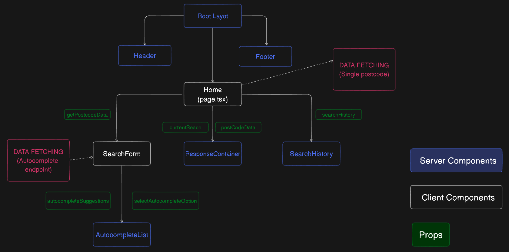

# How to run
First, run **npm install** in the project directory to install all necessary dependencies. After installation is complete, start the local development server with **npm run dev**.

## Project Overview
This is a simple wrapper around the Postcode.io API. The application fetches an address based on the typed postcode and displays the distance between the location and the Heathrow Airport in London. It also keeps a small history log of the searched postcodes.

## Unit Tests

I included 11 unit tests to assure that the main functionalities of the app work as they should. To run the tests, execute the command **npm run test**. 

## Data Comparison and Validation

The data generated by the application has been validated several times by comparing its results to the ones from the "Measure distance" tool from Google maps. When zoomed in, the image below shows the same location and distance in both platforms. 

Please refer to documents folder to have a better look at the image.

## Project Mockup

